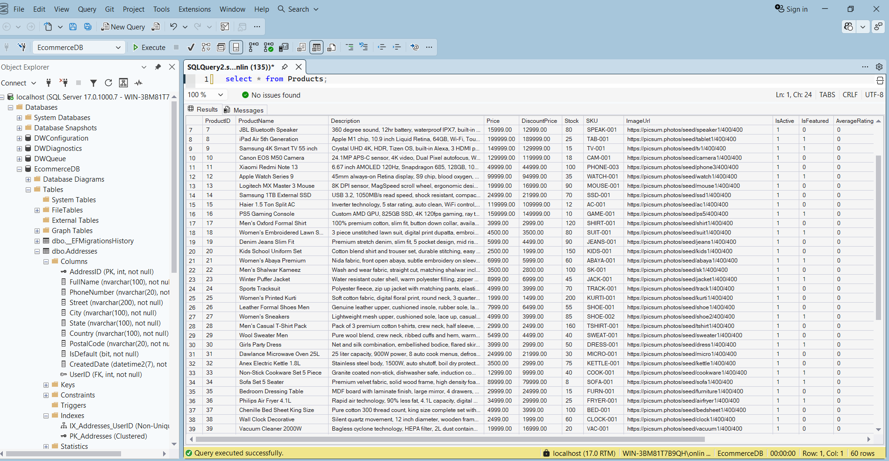
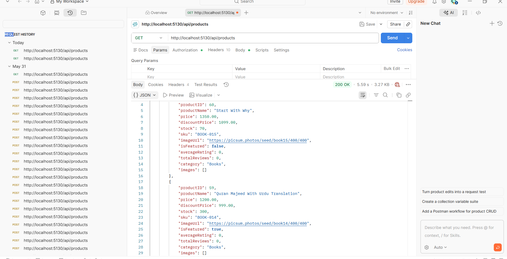
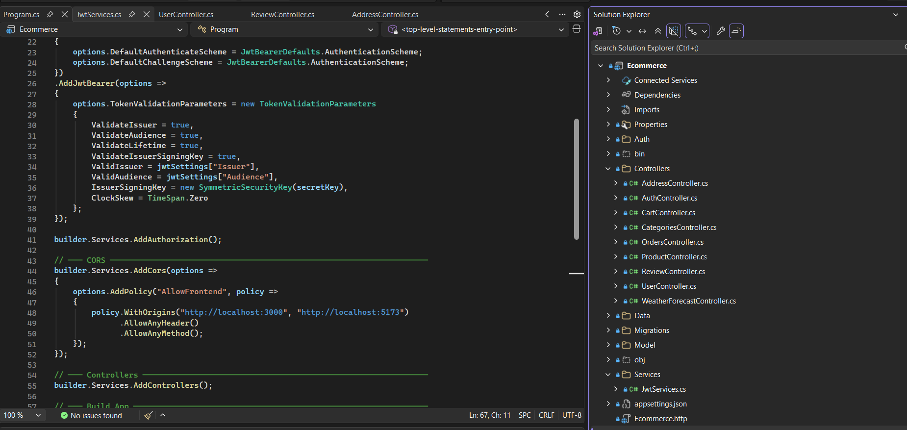

# Ecommerce Backend API (.NET)

A RESTful E-commerce backend built with **ASP.NET Core Web API**, **Entity Framework Core**, and **SQL Server**. Includes JWT-based authentication, full product/order management, and is fully tested with Postman.

## 🚀 Features

- **JWT Authentication & Authorization** (Login/Register, secured endpoints)
- **Product Management** (CRUD, categories, images, featured products, ratings)
- **Cart & Cart Items** management
- **Order & Order Items** processing
- **Address Management** for users
- **Reviews & Ratings** system
- **Payments** module
- **User Management**
- SQL Server database with EF Core Migrations
- CORS enabled for frontend integration (React/Vite)

## 🛠️ Tech Stack

- ASP.NET Core (.NET 8/9)
- Entity Framework Core
- SQL Server
- JWT Bearer Authentication
- Postman (API testing)

## 📂 Project Structure

```
Ecommerce/
├── Auth/
├── Controllers/
│   ├── AddressController.cs
│   ├── AuthController.cs
│   ├── CartController.cs
│   ├── CategoriesController.cs
│   ├── OrdersController.cs
│   ├── ProductController.cs
│   ├── ReviewController.cs
│   └── UserController.cs
├── Data/
│   └── AppDbContext.cs
├── Migrations/
├── Model/
│   ├── AddressModel.cs
│   ├── CartModel.cs
│   ├── CartItemModel.cs
│   ├── CategoryModel.cs
│   ├── OrderModel.cs
│   ├── OrderItemModel.cs
│   ├── PaymentModel.cs
│   ├── ProductModel.cs
│   ├── ProductImageModel.cs
│   ├── ReviewModel.cs
│   └── UserModel.cs
├── Services/
│   └── JwtServices.cs
├── appsettings.json
└── Program.cs
```

## ⚙️ Setup & Installation

1. **Clone the repository**
   ```bash
   git clone https://github.com/yourusername/EcommerceBackendAPI.git
   cd EcommerceBackendAPI
   ```

2. **Configure Database**
   Update the connection string in `appsettings.json`:
   ```json
   "ConnectionStrings": {
     "DefaultConnection": "Server=YOUR_SERVER;Database=EcommerceDB;Trusted_Connection=True;TrustServerCertificate=True"
   }
   ```

3. **Apply Migrations**
   ```bash
   dotnet ef database update
   ```

4. **Run the project**
   ```bash
   dotnet run
   ```

5. API will be available at:
   ```
   http://localhost:5130
   ```

## 🔐 Authentication

This API uses **JWT Bearer Tokens**.

- Register/Login via `AuthController`
- Use the returned token in `Authorization: Bearer <token>` header for protected endpoints

## 📡 API Endpoints (Sample)

| Method | Endpoint                  | Description            |
|--------|---------------------------|-------------------------|
| GET    | /api/products              | Get all products       |
| GET    | /api/products/{id}         | Get product by ID      |
| POST   | /api/auth/register         | Register new user      |
| POST   | /api/auth/login             | Login & get JWT token  |
| GET    | /api/cart                   | Get user cart          |
| POST   | /api/orders                  | Place an order         |
| GET    | /api/categories              | Get all categories     |
| GET    | /api/address                 | Get user addresses     |
| GET    | /api/review                  | Get product reviews    |

## 🧪 Testing

All endpoints have been tested using **Postman**, including:
- Authentication flow (JWT)
- Product CRUD operations
- Cart & Order workflows
- Response validation (200 OK with proper JSON structure)

## 🗄️ Database

The project uses **SQL Server** with Entity Framework Core for data persistence.

Open the database via **SQL Server Management Studio (SSMS)**:
- Server name: as defined in `appsettings.json` (e.g. `localhost`, `.`, or `(localdb)\MSSQLLocalDB`)
- Authentication: Windows Authentication (default)
- Database name: `EcommerceDB`

## 📸 Screenshots

### Database (SQL Server)


### Postman API Testing


### Project Structure


## 📌 Notes

- CORS is configured to allow requests from `http://localhost:3000` and `http://localhost:5173`
- Make sure SQL Server is running before starting the API

## 👤 Author

Developed as a personal/academic E-commerce backend project.
